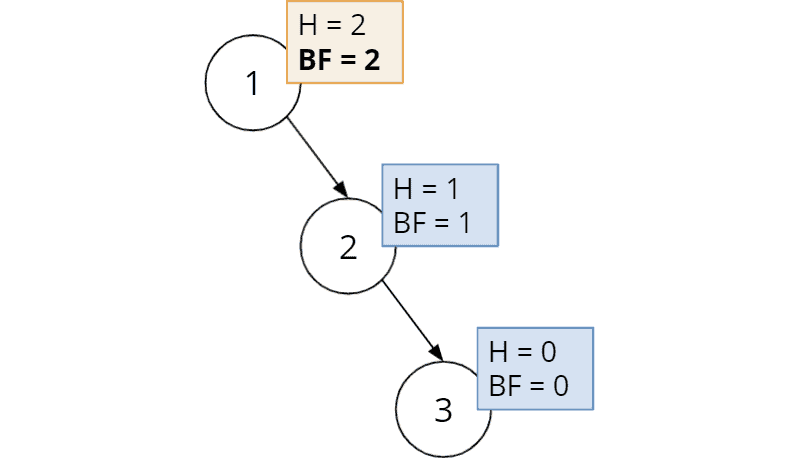
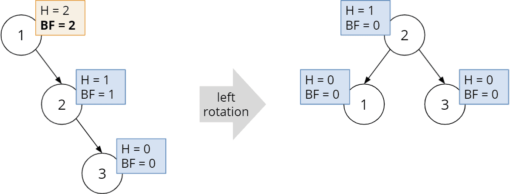
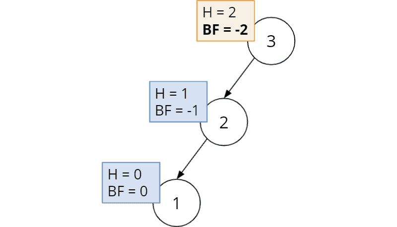
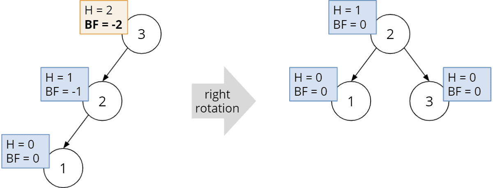
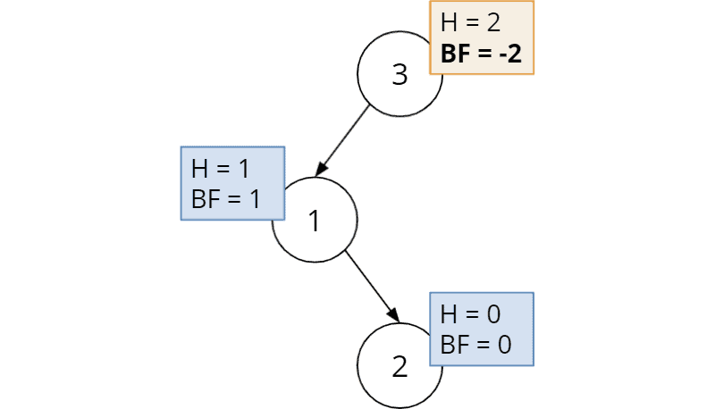
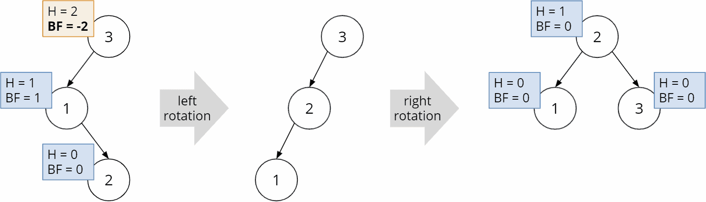
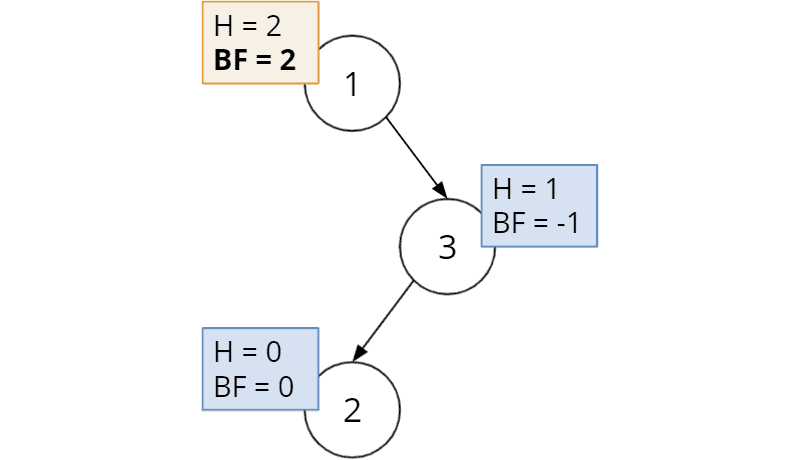
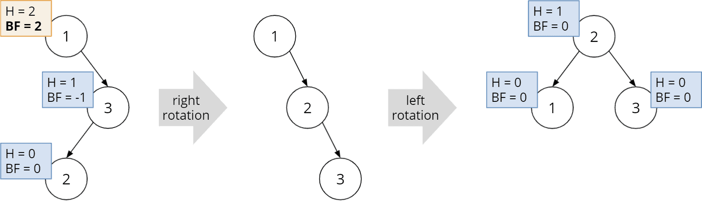

# Midterm Practice Solutions + study guide

## Study Guide

### AVL Trees

#### When do I do left rotation?

Does it look like this?



Then do left rotation



#### When do I do right rotation?

Does it look like this?



Then do right rotation



### When do I do left-right rotation?

Does it look like this?



Then do left-right rotation



### When do I do right-left rotation

Does it look like this?



Then do right-left rotation




## Here's the ones you wanted

Disclaimer these may or may not be correct since I haven't tested, but they're *probably* correct

```
You are standing at the point (n,m) of the grid of positive integers and want to go
to origin (0,0) by taking steps either to left or down: that is, from each point (n,m) you are
allowed to move either to the point (n-1,m) or the point (n,m-1). Write a method int
countPaths(int n, int m) that counts the number of different paths from the point (n,m) to
the origin
```

Solution

```
/**
    Recursive is probably the way to go here

    Base Cases:
        If I am at point (0, m), there is only one path because I can only move in the direction of m - 1
        If I am at point (n, 0), there is only one path because I can only move in the direction of n - 1

    Recursive case:
        It's as simple as adding the number of paths from (n, m-1) and (m, n-1). THIS IS HOW YOU THINK OF RECURSION.
        I ADDED THE EXPLANATION BELOW TO MAKE IT MAKE SENSE, BUT THE IDEA IS THAT IF I HAVE BASE CASES, AND I THINK OF
        THE RECURSIVE RELATIONSHIP, I DON'T NEED TO THINK ANYMORE!!!!!! I HAVE MY BASE CASES, SO I CAN ASSUME THAT THE RECURSIVE
        CALLS WILL ALWAYS GIVE ME WHAT I WANT. SO IF I HAVE MY BASE CASES, THEN I KNOW THAT countPaths(n, m - 1) WILL GIVE ME HOW MANY PATHS I HAVE AT (n, m - 1). THAT'S IT!!!!!!!!!!

        Why? The only way there is 1 path is if I lie on an axis as stated in the base case. If I am not on the axis,
        I want to get to the axis. And the path to that axis counts as 1 path. So I don't actually count it as a path
        until I am at the axis. The recursive call lets us explore all combinations of (x, y) that are valid moves (ie. follow
        (n - 1, m) or (n, m - 1)) and thus by exploring each one, we'll eventually hit the axis for all of the combinations of those moves. And then at that point, we count the path as a path to the origin.

    P.S, I looked this up afterwards on google: https://www.geeksforgeeks.org/counts-paths-point-reach-origin/
*/

int countPaths(int n, int m) {
    if (n == 0 || m == 0) {
        return 1;
    }

    return (countPaths(n - 1, m) + countPaths(n, m - 1));
}
```

Ok, next one

```
You want to write a function RangeRemoval for an array that will have two parameters,
low and high value defining a range of integers (you can assume the second parameter is less
than or equal to the third parameter), and an array. Your task is to remove all values in the array,
whose elements are between the second and third parameters, inclusive, from the parameter list.
For example, if the array were of size 12 and was as follows:
[0, 1 ,2, 4, 5, 7, 8, 9, 11, 12, 15, 17
and your second and third parameters were 6 and 12, respectively, then the parameter list
becomes:
[0, 1 ,2, 4, 5, 15, 17, _, _, _, _ , _]
```

```
/**
    Ok so this one isn't too bad I don't think. We'll take a funky approach

    1. First part is the easiest, iterate over the list and replace each value that satisfies the requirements with an '_'
    2. Now the tricky part, re-arranging the list so the order is kept but all '_' are at the end

    If you remember bubble sort, you can make your own implementation of it where the only time you will do a swap
    is if you find an '_'.

    I'll do something different. I'm going to use 2 indices to keep track of the next number that should replace an '_'. This is what I mean:

    I'm going to modify the example above because it doesn't explicitly say the array will be sorted, so we need to think about that. Here is the new one:
    
    [0, 1 ,7 , 4, 5, 9, 15, 2, 11, 12, 8, 17]

    After replacing, and without doing anything else, we get:

    [0, 1, _, 4, 5, _, 15, 2, _, _, _, 17]

    I'll have two pointers (indeces):

    int leftMostUnderscore; (p_)
    int leftMostOutOfPlaceNumber; (pn)

    I'll first start both pointers at 0. 

    [0, 1, _, 4, 5, _, 15, 2, _, _, _, 17]
    pn
    p_

    I'll move both pointers until I find the first underscore

    [0, 1, _, 4, 5, _, 15, 2, _, _, _, 17]
           pn
           p_

    Now I'll move pn until I find the first number
    [0, 1, _, 4, 5, _, 15, 2, _, _, _, 17]
           p_ pn
    

    Here is the repetivie part. 
    If I find a pn has a number, I swap with p_ and move p_ forward.
    Then I just keep moving p_ until I find another _. 
    Then I move pn until I find a number. Then repeat from the top

    Now I swap the values at p_ and pn
    [0, 1, 4, _, 5, _, 15, 2, _, _, _, 17]
           p_ pn
    
    [0, 1, 4, _, 5, _, 15, 2, _, _, _, 17]
              p_
              pn
    
    Found the next '_'! Let's move pn

    [0, 1, 4, _, 5, _, 15, 2, _, _, _, 17]
              p_ pn
    
    Found a number! Swap and move p_ forward
    
    [0, 1, 4, 5, _, _, 15, 2, _, _, _, 17]
                 pn
                 p_

    Found the next '_'! Let's move pn

    [0, 1, 4, 5, _, _, 15, 2, _, _, _, 17]
                 p_ pn

    No number, keep going
    
    [0, 1, 4, 5, _, _, 15, 2, _, _, _, 17]
                 p_    pn

    Found a number! Swap and move p_ forward

    [0, 1, 4, 5, 15, _, _, 2, _, _, _, 17]
                     p_ pn

    Found the next '_'! Let's move pn

    [0, 1, 4, 5, 15, _, _, 2, _, _, _, 17]
                     p_    pn

    Found a number! Swap and move p_ forward
    [0, 1, 4, 5, 15, 2, _, _, _, _, _, 17]
                        p_ pn

    Found the next '_'! Let's move pn
    
    [0, 1, 4, 5, 15, 2, _, _, _, _, _, 17]
                        p_    pn

    No number, keep going
    
    [0, 1, 4, 5, 15, 2, _, _, _, _, _, 17]
                        p_       pn

    No number, keep going
    
    [0, 1, 4, 5, 15, 2, _, _, _, _, _, 17]
                        p_          pn

    No number, keep going
    
    [0, 1, 4, 5, 15, 2, _, _, _, _, _, 17]
                        p_             pn

    Found a number! Swap and move p_ forward

    [0, 1, 4, 5, 15, 2, 17, _, _, _, _, 2]
                            p_          pn

    pn is at the end. I'm done!
*/


// P.S, it's String[] because '_' is not an integer!!!!!
public void RangeRemoval(String[] a, int low, int high) {
    // Step 1, replace
    for (int i = 0; i < a.length; i++) {
        int val = Integer.parseInt(a[i]);
        if (val >= low && val <= high) {
            a[i] = "_";
        }
    }

    // Step 2, move things
    int leftMostUnderscore = 0;
    int leftMostOutOfPlaceNumber = 0;

    // Move both pointers until we reach the first underscore
    while (!a[leftMostUnderscore].equals("_")) {
        leftMostUnderscore++;
        leftMostOutOfPlaceNumber++;
    }

    // Now move the number pointer until we find the first number. This will put us in a state such that we're
    // ready for the main logic established above
    while (a[leftMostOutOfPlaceNumber].equals("_")) {
        leftMostOutOfPlaceNumber++;
    }

    // Ok now I've found the first "_" and the first number to replace it with. My next loop should behave correctly

    // This is fine, I'll break out when pn reaches the end
    while (true) {
        // If leftMostUnderscore is _ and leftMostOutOfPlaceNumber is number, swap
        if (a[leftMostUnderscore].equals("_") && !a[leftMostOutOfPlaceNumber].equals("_")) {
            a[leftMostUnderscore] = a[leftMostOutOfPlaceNumber];
            a[leftMostOutOfPlaceNumber] = "_";
            leftMostUnderscore++;
        } 
        // If leftMostUnderscore is _ but leftMostOutOfPlaceNumber is not a number, move that forward
        else if (a[leftMostUnderscore].equals("_")) {
            leftMostOutOfPlaceNumber++;
        } 
        // Otherwise, this means leftMostUnderscore is a number, so move that forward
        else {
            leftMostUnderscore++;
        }
    
        if (pn == a.length - 1) {
            // I'm at the last index, I'm done
            break;
        }
    }
}

```


# Last TIP
If you are running low on time and you know you need a helper function to solve something but you don't have enough time/can't figure out the helper, then just write the signature (ie. public int whatever) and leave the body BLANK. Just write in the body a TODO. You'll probably get partial credit if you still "solve" the problem even though your implementation isn't complete.